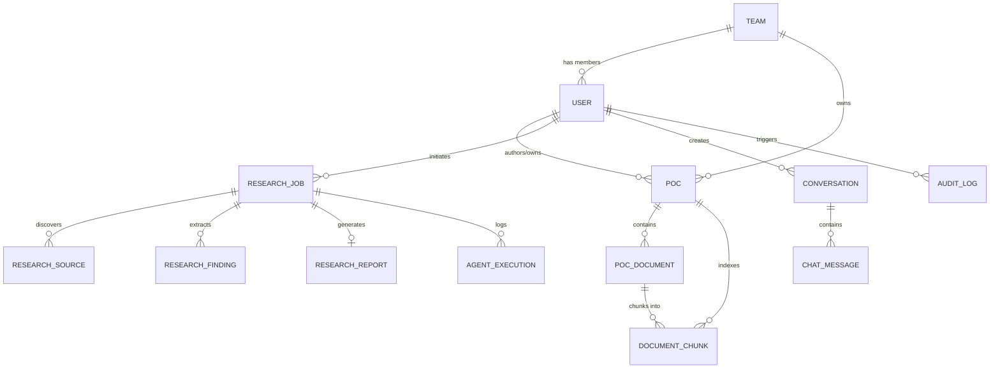

# Data Model & Schema Specification

This document details the PostgreSQL schema with `pgvector` support, entity constraints, and state transitions across the 4 modules.

---

## Entity Relationship Overview

---

## Module 4 Entities: Auth, Workspace & Administration

### `teams`
- `id`: UUID (Primary Key, default uuid_generate_v4())
- `name`: VARCHAR(100) (NOT NULL, UNIQUE)
- `description`: TEXT (NULLABLE)
- `department`: VARCHAR(100) (NOT NULL)
- `created_at`: TIMESTAMPTZ (DEFAULT now())
- `updated_at`: TIMESTAMPTZ (DEFAULT now())

### `users`
- `id`: UUID (Primary Key)
- `name`: VARCHAR(100) (NOT NULL)
- `email`: VARCHAR(255) (NOT NULL, UNIQUE, INDEXED)
- `password_hash`: VARCHAR(255) (NOT NULL)
- `role`: VARCHAR(30) (NOT NULL, DEFAULT 'Developer')
  - Enum: `Super Admin`, `Organization Admin`, `Project Manager`, `Researcher`, `Developer`, `Reviewer`, `Viewer`
- `team_id`: UUID (FOREIGN KEY -> `teams.id`, ON DELETE SET NULL, NULLABLE)
- `is_active`: BOOLEAN (DEFAULT TRUE)
- `last_login_at`: TIMESTAMPTZ (NULLABLE)
- `created_at`: TIMESTAMPTZ (DEFAULT now())
- `updated_at`: TIMESTAMPTZ (DEFAULT now())

### `audit_logs`
- `id`: UUID (Primary Key)
- `user_id`: UUID (FOREIGN KEY -> `users.id`, ON DELETE SET NULL, NULLABLE)
- `action`: VARCHAR(50) (NOT NULL) - e.g. `CREATE`, `UPDATE`, `DELETE`, `ARCHIVE`, `ROLE_CHANGE`
- `entity_type`: VARCHAR(50) (NOT NULL) - e.g. `POC`, `POCDocument`, `ResearchJob`, `User`
- `entity_id`: UUID (NOT NULL)
- `previous_value`: JSONB (NULLABLE)
- `new_value`: JSONB (NULLABLE)
- `ip_address`: VARCHAR(45) (NULLABLE)
- `created_at`: TIMESTAMPTZ (DEFAULT now(), INDEXED)

---

## Module 1 Entities: POC & Document Management

### `pocs`
- `id`: UUID (Primary Key)
- `poc_code`: VARCHAR(50) (NOT NULL, UNIQUE, INDEXED) - e.g. `POC-2026-001`
- `title`: VARCHAR(255) (NOT NULL)
- `short_description`: VARCHAR(500) (NOT NULL)
- `detailed_description`: TEXT (NOT NULL)
- `business_problem`: TEXT (NOT NULL)
- `technical_problem`: TEXT (NOT NULL)
- `objective`: TEXT (NOT NULL)
- `scope`: TEXT (NOT NULL)
- `out_of_scope`: TEXT (NULLABLE)
- `category`: VARCHAR(50) (NOT NULL, INDEXED)
  - Enum: `Artificial Intelligence`, `Machine Learning`, `Generative AI`, `RAG`, `Multi-Agent Systems`, `Web Development`, `Cloud Computing`, `DevOps`, `Data Engineering`, `Cybersecurity`, `IoT`, `Computer Vision`, `NLP`, `Automation`, `Database`, `API Integration`, `Enterprise Software`, `Research and Development`, `Other`
- `priority`: VARCHAR(20) (NOT NULL, DEFAULT 'Medium') - `Low`, `Medium`, `High`, `Critical`
- `status`: VARCHAR(30) (NOT NULL, DEFAULT 'Draft', INDEXED)
  - Enum: `Draft`, `Planned`, `In Progress`, `On Hold`, `Under Review`, `Completed`, `Successful`, `Partially Successful`, `Failed`, `Archived`, `Cancelled`
- `owner_id`: UUID (FOREIGN KEY -> `users.id`, NOT NULL)
- `team_id`: UUID (FOREIGN KEY -> `teams.id`, NOT NULL)
- `technology_stack`: JSONB (NOT NULL, DEFAULT '[]') - Array of strings or tech objects
- `architecture_details`: TEXT (NULLABLE)
- `evaluation_criteria`: JSONB (NULLABLE)
- `test_results`: TEXT (NULLABLE)
- `performance_results`: TEXT (NULLABLE)
- `cost_estimation`: TEXT (NULLABLE)
- `scalability_findings`: TEXT (NULLABLE)
- `security_findings`: TEXT (NULLABLE)
- `limitations`: TEXT (NULLABLE)
- `risks`: TEXT (NULLABLE)
- `recommendations`: TEXT (NULLABLE)
- `outcome`: VARCHAR(50) (NULLABLE)
- `production_readiness`: VARCHAR(50) (NULLABLE)
- `lessons_learned`: TEXT (NULLABLE)
- `ai_summary`: TEXT (NULLABLE)
- `start_date`: DATE (NULLABLE)
- `expected_end_date`: DATE (NULLABLE)
- `completed_date`: DATE (NULLABLE)
- `is_archived`: BOOLEAN (DEFAULT FALSE, INDEXED)
- `created_at`: TIMESTAMPTZ (DEFAULT now())
- `updated_at`: TIMESTAMPTZ (DEFAULT now())

### `poc_documents`
- `id`: UUID (Primary Key)
- `poc_id`: UUID (FOREIGN KEY -> `pocs.id`, ON DELETE CASCADE, NOT NULL)
- `file_name`: VARCHAR(255) (NOT NULL)
- `file_type`: VARCHAR(50) (NOT NULL) - e.g. `application/pdf`, `text/markdown`, `application/vnd.openxmlformats-officedocument.wordprocessingml.document`
- `file_size`: INTEGER (NOT NULL) - Size in bytes (max 26,214,400 = 25MB)
- `storage_url`: VARCHAR(1024) (NOT NULL)
- `version`: INTEGER (DEFAULT 1)
- `description`: VARCHAR(500) (NULLABLE)
- `uploaded_by`: UUID (FOREIGN KEY -> `users.id`, NOT NULL)
- `processing_status`: VARCHAR(30) (DEFAULT 'UPLOADED')
  - Enum: `UPLOADED`, `QUEUED`, `EXTRACTING`, `CLEANING`, `CHUNKING`, `EMBEDDING`, `INDEXING`, `COMPLETED`, `FAILED`, `NEEDS_REINDEX`
- `indexing_status`: VARCHAR(30) (DEFAULT 'NOT_INDEXED')
- `error_message`: TEXT (NULLABLE)
- `created_at`: TIMESTAMPTZ (DEFAULT now())
- `updated_at`: TIMESTAMPTZ (DEFAULT now())

---

## Module 3 Entities: Vector & RAG Knowledge Store

### `document_chunks` (pgvector)
- `id`: UUID (Primary Key)
- `poc_id`: UUID (FOREIGN KEY -> `pocs.id`, ON DELETE CASCADE, NOT NULL, INDEXED)
- `document_id`: UUID (FOREIGN KEY -> `poc_documents.id`, ON DELETE CASCADE, NULLABLE, INDEXED)
- `report_id`: UUID (FOREIGN KEY -> `research_reports.id`, ON DELETE CASCADE, NULLABLE, INDEXED)
- `content`: TEXT (NOT NULL)
- `embedding`: vector(1536) or vector(768) (INDEXED with ivfflat / hnsw cosine distance)
- `chunk_index`: INTEGER (NOT NULL)
- `token_count`: INTEGER (NOT NULL)
- `metadata_json`: JSONB (NOT NULL) - Stores: `poc_code`, `poc_title`, `doc_name`, `section_title`, `page_number`, `team_id`, `category`, `access_scope`
- `created_at`: TIMESTAMPTZ (DEFAULT now())

### `conversations`
- `id`: UUID (Primary Key)
- `user_id`: UUID (FOREIGN KEY -> `users.id`, ON DELETE CASCADE, NOT NULL)
- `title`: VARCHAR(255) (NOT NULL, DEFAULT 'New Conversation')
- `mode`: VARCHAR(50) (NOT NULL, DEFAULT 'ORGANIZATION')
  - Enum: `ORGANIZATION`, `POC_SPECIFIC`, `DOCUMENT_SPECIFIC`, `CATEGORY_SPECIFIC`, `GENERAL_EXPLANATION`
- `poc_id`: UUID (FOREIGN KEY -> `pocs.id`, ON DELETE SET NULL, NULLABLE)
- `document_id`: UUID (FOREIGN KEY -> `poc_documents.id`, ON DELETE SET NULL, NULLABLE)
- `category`: VARCHAR(50) (NULLABLE)
- `created_at`: TIMESTAMPTZ (DEFAULT now())
- `updated_at`: TIMESTAMPTZ (DEFAULT now())

### `chat_messages`
- `id`: UUID (Primary Key)
- `conversation_id`: UUID (FOREIGN KEY -> `conversations.id`, ON DELETE CASCADE, NOT NULL, INDEXED)
- `role`: VARCHAR(20) (NOT NULL) - `user`, `assistant`, `system`
- `content`: TEXT (NOT NULL)
- `retrieved_sources`: JSONB (NULLABLE) - Array of citations with `poc_code`, `document_name`, `section`, `page`, `similarity_score`
- `token_usage`: JSONB (NULLABLE) - `{ prompt_tokens: int, completion_tokens: int, total_tokens: int }`
- `created_at`: TIMESTAMPTZ (DEFAULT now())

---

## Module 2 Entities: Multi-Agent Research System

### `research_jobs`
- `id`: UUID (Primary Key)
- `user_id`: UUID (FOREIGN KEY -> `users.id`, NOT NULL)
- `topic`: VARCHAR(500) (NOT NULL)
- `research_type`: VARCHAR(50) (DEFAULT 'standard') - `technical_overview`, `deep_dive`, `comparison`, `feasibility`
- `depth`: VARCHAR(20) (DEFAULT 'standard') - `shallow`, `standard`, `deep`
- `date_range`: VARCHAR(50) (DEFAULT 'all_time')
- `source_preferences`: JSONB (NULLABLE) - Preferred domains, types
- `status`: VARCHAR(30) (DEFAULT 'CREATED', INDEXED)
  - Enum: `CREATED`, `QUEUED`, `PLANNING`, `SEARCHING`, `COLLECTING_SOURCES`, `ANALYZING`, `VALIDATING`, `GENERATING_REPORT`, `SAVING`, `COMPLETED`, `FAILED`, `CANCELLED`
- `progress`: INTEGER (DEFAULT 0) - Percentage (0-100)
- `current_agent`: VARCHAR(100) (NULLABLE)
- `current_task`: VARCHAR(255) (NULLABLE)
- `error_message`: TEXT (NULLABLE)
- `started_at`: TIMESTAMPTZ (NULLABLE)
- `completed_at`: TIMESTAMPTZ (NULLABLE)
- `created_at`: TIMESTAMPTZ (DEFAULT now())

### `research_sources`
- `id`: UUID (Primary Key)
- `research_job_id`: UUID (FOREIGN KEY -> `research_jobs.id`, ON DELETE CASCADE, NOT NULL, INDEXED)
- `title`: VARCHAR(500) (NOT NULL)
- `url`: VARCHAR(2048) (NOT NULL)
- `domain`: VARCHAR(255) (NOT NULL)
- `source_type`: VARCHAR(50) (DEFAULT 'web') - `official_docs`, `academic_paper`, `github_repo`, `technical_blog`, `news`
- `published_date`: VARCHAR(50) (NULLABLE)
- `retrieved_at`: TIMESTAMPTZ (DEFAULT now())
- `relevance_score`: FLOAT (DEFAULT 1.0)
- `summary`: TEXT (NULLABLE)
- `verification_status`: VARCHAR(30) (DEFAULT 'UNVERIFIED') - `VERIFIED`, `UNVERIFIED`, `REJECTED`

### `research_findings`
- `id`: UUID (Primary Key)
- `research_job_id`: UUID (FOREIGN KEY -> `research_jobs.id`, ON DELETE CASCADE, NOT NULL, INDEXED)
- `question`: TEXT (NOT NULL)
- `finding`: TEXT (NOT NULL)
- `evidence`: TEXT (NOT NULL)
- `source_ids`: JSONB (NOT NULL, DEFAULT '[]') - Array of source UUIDs
- `confidence`: FLOAT (DEFAULT 0.8)
- `validation_status`: VARCHAR(30) (DEFAULT 'VALIDATED') - `VALIDATED`, `UNCERTAIN`, `DISPUTED`
- `created_at`: TIMESTAMPTZ (DEFAULT now())

### `research_reports`
- `id`: UUID (Primary Key)
- `research_job_id`: UUID (FOREIGN KEY -> `research_jobs.id`, ON DELETE CASCADE, NOT NULL, UNIQUE)
- `title`: VARCHAR(500) (NOT NULL)
- `executive_summary`: TEXT (NOT NULL)
- `content_markdown`: TEXT (NOT NULL)
- `report_type`: VARCHAR(50) (DEFAULT 'standard')
- `status`: VARCHAR(30) (DEFAULT 'DRAFT') - `DRAFT`, `FINAL`, `ARCHIVED`
- `version`: INTEGER (DEFAULT 1)
- `created_by`: UUID (FOREIGN KEY -> `users.id`, NOT NULL)
- `saved_to_knowledge_base`: BOOLEAN (DEFAULT FALSE)
- `created_at`: TIMESTAMPTZ (DEFAULT now())
- `updated_at`: TIMESTAMPTZ (DEFAULT now())

### `agent_executions`
- `id`: UUID (Primary Key)
- `research_job_id`: UUID (FOREIGN KEY -> `research_jobs.id`, ON DELETE CASCADE, NOT NULL, INDEXED)
- `agent_name`: VARCHAR(100) (NOT NULL)
- `task_name`: VARCHAR(150) (NOT NULL)
- `status`: VARCHAR(30) (NOT NULL) - `RUNNING`, `SUCCESS`, `FAILED`
- `input_data`: JSONB (NULLABLE)
- `output_data`: JSONB (NULLABLE)
- `error_message`: TEXT (NULLABLE)
- `token_usage`: JSONB (NULLABLE)
- `execution_time_ms`: INTEGER (NULLABLE)
- `started_at`: TIMESTAMPTZ (DEFAULT now())
- `completed_at`: TIMESTAMPTZ (NULLABLE)
